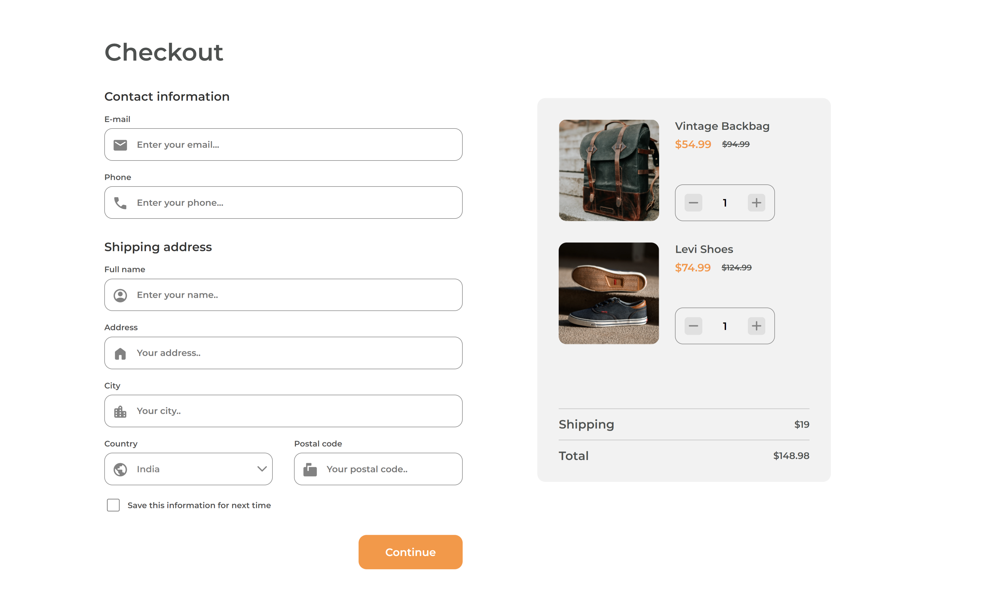

<!-- Please update value in the {}  -->

<h1 align="center">Checkout Page using LESS</h1>

   Solution for a challenge from  <a href="http://devchallenges.io" target="_blank">Devchallenges.io</a>.

  <h3>
    <a href="https://checkout-page-green.vercel.app/">
      Demo
    </a>
     | 
    <a href="https://github.com/ShrutiShinde418/DevChallenges1/tree/main/checkout-page">
      Solution
    </a>
     | 
    <a href="https://devchallenges.io/challenges/ohgVTyJCbm5OZyTB2gNY">
      Challenge
    </a>
  </h3>

## Table of Contents

- [Table of Contents](#table-of-contents)
- [Overview](#overview)
  - [Built With](#built-with)
  - [What I Learned](#what-i-learned)
  - [Useful Resources](#useful-resources)
- [Contact](#contact)

## Overview

### Built With

- [LESS CSS](https://lesscss.org/)

### What I Learned

- LESS CSS
- Form Validation using Javascript
- Adding counter button with inputs
- changing total cost according to the cart

### Useful Resources

- [Youtube Tutorial for LESS](https://www.youtube.com/watch?v=YD91G8DdUsw&pp=ygUIbGVzcyBjc3M%3D) 
- [Form Validation using JavaScript](https://www.youtube.com/watch?v=CYlNJpltjMM&pp=ygUdZm9ybSB2YWxpZGF0aW9uIGluIGphdmFzY3JpcHQ%3D)

## Contact

- GitHub [@ShrutiShinde418](https://github.com/ShrutiShinde418)
